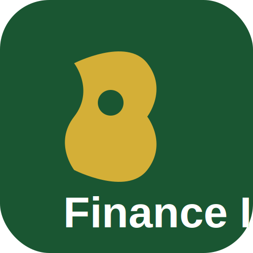

# Finance ISL - Islamic Finance Blog Platform

A comprehensive, responsive, and progressive web application for Islamic finance content. Built with vanilla HTML, CSS, and JavaScript - no frameworks required.



## 📋 Table of Contents

- [Features](#features)
- [Project Structure](#project-structure)
- [Getting Started](#getting-started)
- [Content Management](#content-management)
- [Customization](#customization)
- [PWA Configuration](#pwa-configuration)
- [Deployment](#deployment)
- [Troubleshooting](#troubleshooting)

---

## ✨ Features

### Core Features
- ✅ **Fully Responsive** - Works on all devices (mobile, tablet, desktop)
- ✅ **Progressive Web App (PWA)** - Installable, works offline
- ✅ **4 Theme System** - Light, Dark, Emerald, and Golden themes
- ✅ **Dynamic Content** - JSON-based content management
- ✅ **Offline Support** - Service worker with cache-first strategy
- ✅ **Pull-to-Refresh** - Mobile-friendly content refresh
- ✅ **Smooth Navigation** - SPA-like experience with hash routing
- ✅ **Back Button Support** - Proper browser history management
- ✅ **Scroll Position Memory** - Returns to previous scroll position

### UI Components
- 🍔 **Hamburger Menu** - Collapsible sidebar with categories and subtopics
- 🔍 **Search Functionality** - Full-text search across all content
- 💬 **Contact Form** - Floating action button with contact modal
- ⬆️ **Back to Top** - Smooth scroll to top button
- 📱 **Toast Notifications** - User feedback messages
- 🔄 **Pull to Refresh** - Mobile gesture support

### Content Types
- 📝 **Blog Posts** - Rich text with multiple content blocks
- 📊 **Tables** - Responsive data tables
- 🎬 **Videos** - Embedded video support
- 📸 **Images** - Responsive image handling
- 💬 **Quotes** - Styled blockquotes with citations
- 📋 **Lists** - Ordered and unordered lists
- ⚠️ **Callouts** - Info, warning, success, and error messages
- 📥 **Downloads** - File download cards with metadata
- 📚 **Glossary** - Searchable Islamic finance terminology
- ❓ **FAQs** - Accordion-style frequently asked questions

---

## 📁 Project Structure

```
finance-isl/
│
├── index.html              # Main HTML file (single entry point)
├── manifest.json           # PWA manifest
├── sw.js                   # Service Worker
├── README.md               # This file
│
├── css/
│   └── styles.css          # Main stylesheet (all styles in one file)
│
├── js/
│   ├── app.js              # Main application logic
│   ├── content.js          # Content manager (loads JSON)
│   ├── router.js           # Client-side router
│   ├── storage.js          # Local storage manager
│   └── theme.js            # Theme manager
│
├── json/
│   ├── app-config.json     # Application configuration
│   ├── blog-posts.json     # Blog posts content
│   ├── navigation.json     # Navigation menu structure
│   ├── downloads.json      # Downloadable resources
│   ├── faqs.json           # Frequently asked questions
│   ├── glossary.json       # Islamic finance glossary
│   └── about.json          # About page content
│
├── icons/
│   ├── favicon.svg         # Browser favicon
│   ├── logo.svg            # Website logo
│   ├── icon-192.svg        # PWA icon (192x192)
│   └── icon-512.svg        # PWA icon (512x512)
│
├── images/
│   ├── posts/              # Blog post images
│   ├── authors/            # Author avatars
│   ├── downloads/          # Download thumbnails
│   ├── team/               # Team member photos
│   └── partners/           # Partner logos
│
├── downloads/              # Downloadable files
│   └── (your files here)
│
└── fonts/                  # Self-hosted fonts (optional)
    └── (your fonts here)
```

---

## 🚀 Getting Started

### Prerequisites
- A modern web browser
- A local web server (for development)
- Text editor or IDE

### Installation

1. **Download or Clone** the project files to your local machine

2. **Start a Local Server**
   
   Using Python:
   ```bash
   cd finance-isl
   python -m http.server 8000
   ```
   
   Using Node.js (with http-server):
   ```bash
   npx http-server -p 8000
   ```
   
   Using PHP:
   ```bash
   php -S localhost:8000
   ```

3. **Open in Browser**
   Navigate to `http://localhost:8000`

### For Production
Upload all files to your web hosting provider. Ensure:
- All files maintain the same directory structure
- Your server supports HTTPS (required for PWA)
- Service worker file (`sw.js`) is in the root directory

---

## 📝 Content Management

### Adding New Blog Posts

Edit `json/blog-posts.json` and add a new post object:

```json
{
  "id": "your-post-slug",
  "title": "Your Post Title",
  "slug": "your-post-slug",
  "excerpt": "Brief description of the post...",
  "category": "islamic-finance",
  "subtopic": "murabaha",
  "author": {
    "name": "Author Name",
    "avatar": "images/authors/author.jpg",
    "bio": "Author bio"
  },
  "publishedDate": "2026-07-20",
  "modifiedDate": "2026-07-20",
  "readingTime": "10 min",
  "featured": false,
  "tags": ["tag1", "tag2", "tag3"],
  "featuredImage": {
    "src": "images/posts/your-image.jpg",
    "alt": "Image description",
    "caption": "Image caption"
  },
  "content": [
    {
      "type": "paragraph",
      "text": "Your paragraph text..."
    },
    {
      "type": "heading",
      "level": 2,
      "text": "Section Heading"
    },
    {
      "type": "list",
      "style": "unordered",
      "items": ["Item 1", "Item 2", "Item 3"]
    },
    {
      "type": "quote",
      "text": "Quote text",
      "source": "Source name"
    },
    {
      "type": "table",
      "headers": ["Column 1", "Column 2"],
      "rows": [["Data 1", "Data 2"]],
      "caption": "Table caption"
    },
    {
      "type": "video",
      "url": "https://www.youtube.com/embed/VIDEO_ID",
      "title": "Video title"
    },
    {
      "type": "callout",
      "style": "info",
      "title": "Important Note",
      "text": "Callout content..."
    }
  ],
  "relatedPosts": ["post-id-1", "post-id-2"]
}
```

### Content Block Types

| Type | Description | Properties |
|------|-------------|------------|
| `paragraph` | Text paragraph | `text` |
| `heading` | Section heading | `level` (1-6), `text` |
| `list` | Ordered/unordered list | `style` ("ordered"/"unordered"), `items` |
| `quote` | Blockquote | `text`, `source` (optional) |
| `table` | Data table | `headers`, `rows`, `caption` (optional) |
| `video` | Embedded video | `url`, `title` (optional), `caption` (optional) |
| `image` | Image with caption | `src`, `alt`, `caption` (optional) |
| `callout` | Alert box | `style` ("info"/"warning"/"success"/"error"), `title`, `text` |

### Categories and Subtopics

Your content is organized into main categories and subtopics:

**Business Management**
- Leadership, Strategy, Marketing, Operations
- Human Resources, Entrepreneurship, Financial Management, Innovation

**Islamic Finance**
- Islamic Banking, Murabaha, Mudarabah, Musharakah
- Ijarah, Sukuk, Takaful, Zakat, Waqf, Islamic Economics

**Ethics**
- Business Ethics, Corporate Governance, Social Responsibility
- Maqasid al-Shariah, Sustainable Business

**Learning Resources**
- Beginner Guides, Case Studies, Research Articles
- Downloads, FAQs, Glossary

### Adding Downloads

Edit `json/downloads.json`:

```json
{
  "id": "resource-id",
  "name": "Resource Name",
  "description": "Description of the resource...",
  "category": "learning-resources",
  "subtopic": "downloads",
  "format": "pdf",
  "size": "1.5 MB",
  "sizeBytes": 1572864,
  "version": "1.0",
  "lastUpdated": "2026-07-20",
  "downloadUrl": "downloads/your-file.pdf",
  "image": "images/downloads/thumbnail.jpg",
  "tags": ["tag1", "tag2"],
  "featured": false,
  "downloadCount": 0
}
```

### Adding Glossary Terms

Edit `json/glossary.json`:

```json
{
  "term": "Term Name",
  "arabic": "Arabic Text",
  "pronunciation": "pro-nun-ci-a-tion",
  "definition": "Definition of the term...",
  "category": "Category Name",
  "relatedTerms": ["Related Term 1", "Related Term 2"]
}
```

### Adding FAQs

Edit `json/faqs.json`:

```json
{
  "category": "Category Name",
  "questions": [
    {
      "id": "faq-id",
      "question": "Your question?",
      "answer": "Your answer...",
      "tags": ["tag1", "tag2"]
    }
  ]
}
```

---

## 🎨 Customization

### Changing Themes

The app includes 4 built-in themes:

1. **Light** (default) - Clean white background
2. **Dark** - Dark mode for low-light environments
3. **Emerald** - Green-tinted theme
4. **Golden** - Warm gold-tinted theme

Users can cycle through themes using the theme toggle button in the header.

### Modifying Theme Colors

Edit the CSS variables in `css/styles.css`:

```css
:root {
  --primary: #1a5632;        /* Main brand color */
  --secondary: #2d8a56;      /* Secondary color */
  --accent: #d4af37;         /* Accent/highlight color */
  --background: #ffffff;     /* Page background */
  --surface: #ffffff;        /* Card/component background */
  --text: #1a1a1a;           /* Main text color */
  --text-secondary: #666666; /* Secondary text */
}
```

### Changing App Name

1. Edit `json/app-config.json`:
   ```json
   {
     "app": {
       "name": "Your New Name",
       "description": "Your description..."
     }
   }
   ```

2. Update `index.html` title and meta tags

3. Update `manifest.json` name and short_name

---

## 📱 PWA Configuration

### Updating the Service Worker

When you update content, increment the cache version in `sw.js`:

```javascript
const CACHE_NAME = 'finance-isl-v2'; // Increment version
```

### Adding to Home Screen

Users can install the app on their device:
1. Open the website in a mobile browser
2. Tap "Add to Home Screen" or the install prompt
3. The app will work like a native app

### Offline Behavior

- **Online**: Content is fetched from server and cached
- **Offline**: Content loads from cache
- **Pull to Refresh**: Refreshes when online, shows cached content when offline

---

## 🌐 Deployment

### Static Hosting (Recommended)

**Netlify:**
1. Drag and drop the `finance-isl` folder to Netlify
2. Enable HTTPS in settings
3. Done!

**Vercel:**
```bash
npx vercel --prod
```

**GitHub Pages:**
1. Push to GitHub repository
2. Enable GitHub Pages in settings
3. Select source branch

**Traditional Hosting:**
1. Upload all files via FTP/SFTP
2. Ensure `index.html` is in the root
3. Configure server to serve `index.html` for all routes

### Server Configuration

**Apache (.htaccess):**
```apache
RewriteEngine On
RewriteBase /
RewriteRule ^index\.html$ - [L]
RewriteCond %{REQUEST_FILENAME} !-f
RewriteCond %{REQUEST_FILENAME} !-d
RewriteRule . /index.html [L]

# Enable compression
<IfModule mod_deflate.c>
  AddOutputFilterByType DEFLATE text/html text/css application/javascript application/json
</IfModule>

# Cache static assets
<IfModule mod_expires.c>
  ExpiresActive On
  ExpiresByType image/svg+xml "access plus 1 year"
  ExpiresByType text/css "access plus 1 month"
  ExpiresByType application/javascript "access plus 1 month"
</IfModule>
```

**Nginx:**
```nginx
server {
    listen 80;
    server_name yourdomain.com;
    root /path/to/finance-isl;
    index index.html;
    
    location / {
        try_files $uri $uri/ /index.html;
    }
    
    location ~* \.(js|css|svg|png|jpg|jpeg|gif|ico)$ {
        expires 1y;
        add_header Cache-Control "public, immutable";
    }
}
```

---

## 📧 Contact Form Setup

The contact form uses `mailto:` protocol to send messages. To enable direct email sending:

### Option 1: EmailJS (Client-side)
1. Sign up at [emailjs.com](https://www.emailjs.com/)
2. Create an email template
3. Update `js/app.js` contact form handler:

```javascript
// Add EmailJS SDK to index.html
// <script src="https://cdn.jsdelivr.net/npm/@emailjs/browser@3/dist/email.min.js"></script>

async handleContactSubmit(e) {
  e.preventDefault();
  
  emailjs.init("YOUR_PUBLIC_KEY");
  
  await emailjs.send("YOUR_SERVICE_ID", "YOUR_TEMPLATE_ID", {
    from_email: email,
    message: message
  });
}
```

### Option 2: Formspree
1. Sign up at [formspree.io](https://formspree.io/)
2. Create a form endpoint
3. Update form action:

```html
<form action="https://formspree.io/f/YOUR_FORM_ID" method="POST">
```

### Option 3: Custom Backend
Create a simple API endpoint to handle form submissions.

---

## 🔍 SEO Optimization

### Meta Tags
Update meta tags in `index.html` for each page:
- Title tag
- Description
- Keywords
- Open Graph tags
- Twitter Card tags

### Structured Data
Add JSON-LD structured data for rich snippets.

### Sitemap
Create `sitemap.xml` listing all your pages.

### robots.txt
```
User-agent: *
Allow: /
Sitemap: https://yourdomain.com/sitemap.xml
```

---

## 🛠️ Troubleshooting

### Content Not Updating
1. Clear browser cache
2. Increment cache version in `sw.js`
3. Unregister service worker in DevTools

### Offline Mode Issues
1. Check service worker registration
2. Verify cache strategy in `sw.js`
3. Check browser console for errors

### Images Not Loading
1. Verify image paths are correct
2. Check file extensions match
3. Ensure images are in correct directory

### Theme Not Applying
1. Clear localStorage
2. Check for CSS syntax errors
3. Verify data-theme attribute

---

## 📚 Resources

- [Islamic Finance Glossary](https://en.wikipedia.org/wiki/Islamic_banking_and_finance)
- [AAOIFI Standards](https://aaoifi.com/)
- [PWA Documentation](https://web.dev/progressive-web-apps/)

---

## 📄 License

This project is open source and available for personal and commercial use.

---

## 👥 Credits

**Finance ISL** - Islamic Finance Knowledge Platform

For questions or support, contact: abdulrahamanraye68@gmail.com

---

## 🔄 Version History

### v1.0.0 (2026-07-20)
- Initial release
- Full PWA support
- 4 theme system
- JSON-based content management
- Responsive design
- Offline support
- Pull-to-refresh
- Search functionality
- Contact form
- Glossary, FAQs, and Downloads sections

---

Made with ❤️ for the Islamic Finance Community